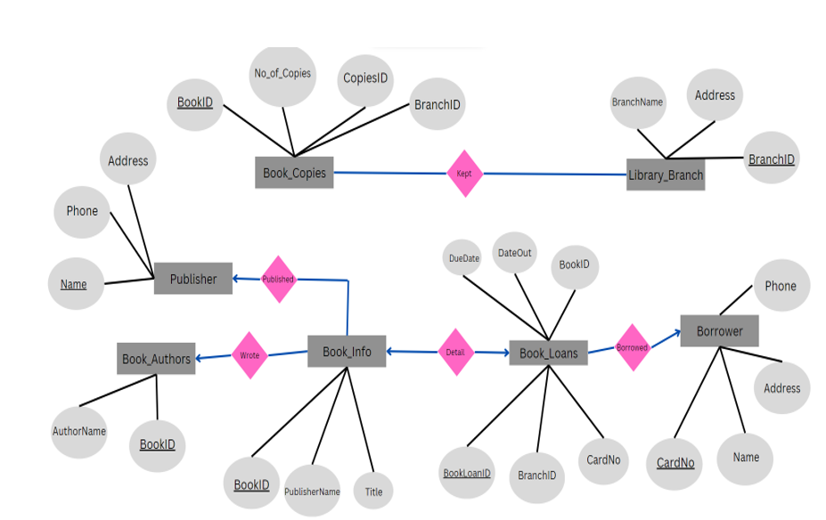
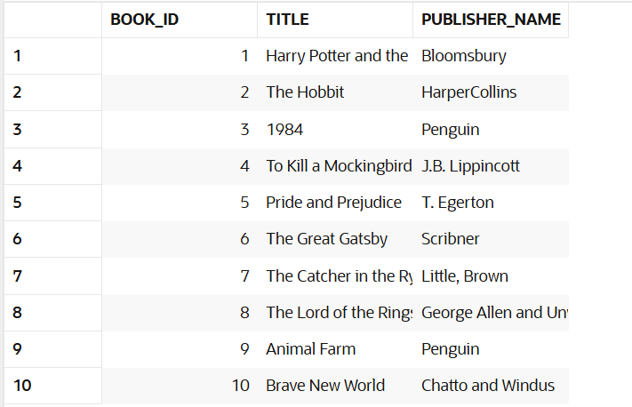
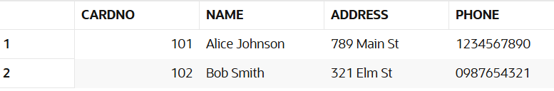
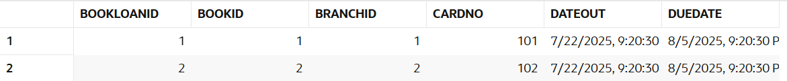
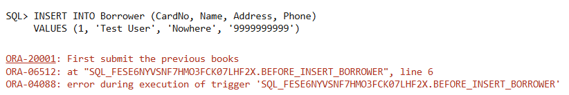
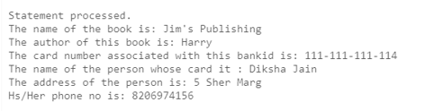
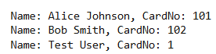

# 📚 Library Management System (Oracle SQL)

A complete relational database system for managing a library's operations — including book lending, author/publisher details, and borrower tracking — built in **Oracle SQL** with support for triggers, procedures, cursors, and analytical functions.

---

## 🗃️ Schema Features

- 📖 Track books, authors, and publishers  
- 🏢 Multi-branch library system  
- 👤 Borrower records with phone/address  
- 📚 Book availability per branch  
- 🔄 Loans and due-date tracking  
- ✅ Trigger to prevent duplicate borrowers  
- 🔍 Function to count books by publisher  
- 📋 Procedure to fetch borrower + book metadata  
- 🔁 Cursor to loop over borrower records  

---

## 📐 Entity-Relationship Diagram



---

## 📊 Sample Table Outputs

### 📗 `BOOK_INFO` Table  


### 👥 `BORROWER` Table  


### 📄 `BOOK_LOANS` Table  


---

## ⚙️ Logic Demonstrations

### ✅ Trigger Output: Prevent Duplicate Borrowers  


### 📋 Procedure Output: Book + Borrower Metadata  
```sql
EXEC Showdata(bookid => 'B101', bankid => 'L203');
```


### 🔁 Cursor Output: Looping Over Borrower Records  


---

## 🛠️ Technologies Used

- **Oracle SQL / PL-SQL**
- Tables, Primary & Foreign Keys  
- Triggers  
- Functions & Procedures  
- Cursors  

---

## 📦 How to Use

1. Ensure you have access to an **Oracle DB** (local or cloud).
2. Use **Oracle SQL Developer** or any Oracle-compatible SQL client.
3. Run the full script step by step from the `code.sql` file:

```sql
-- From SQL Developer or SQL*Plus
@code.sql
```

